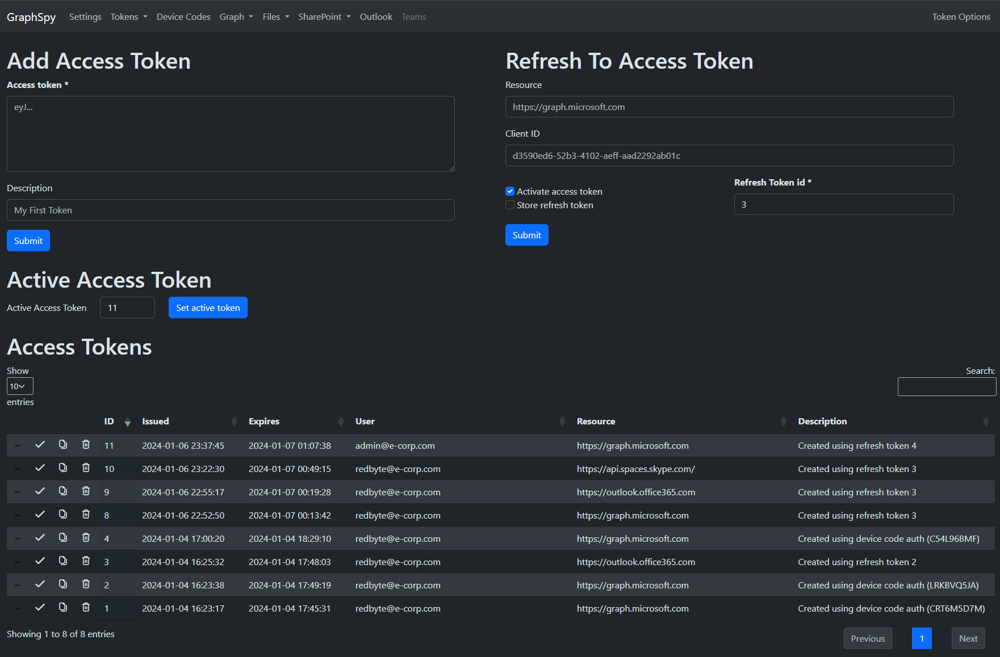
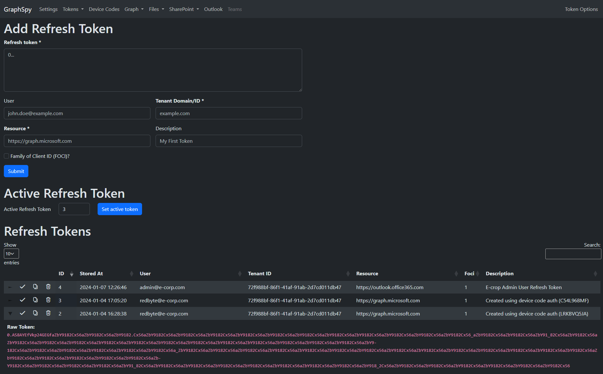
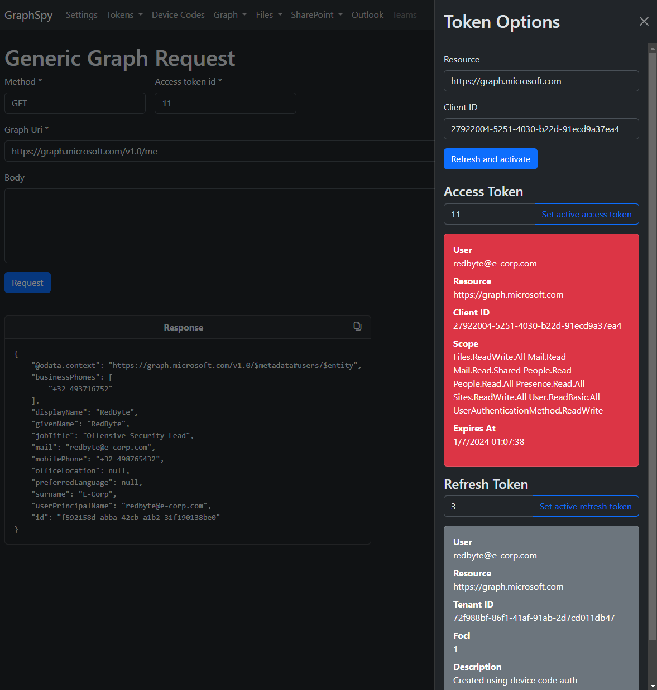
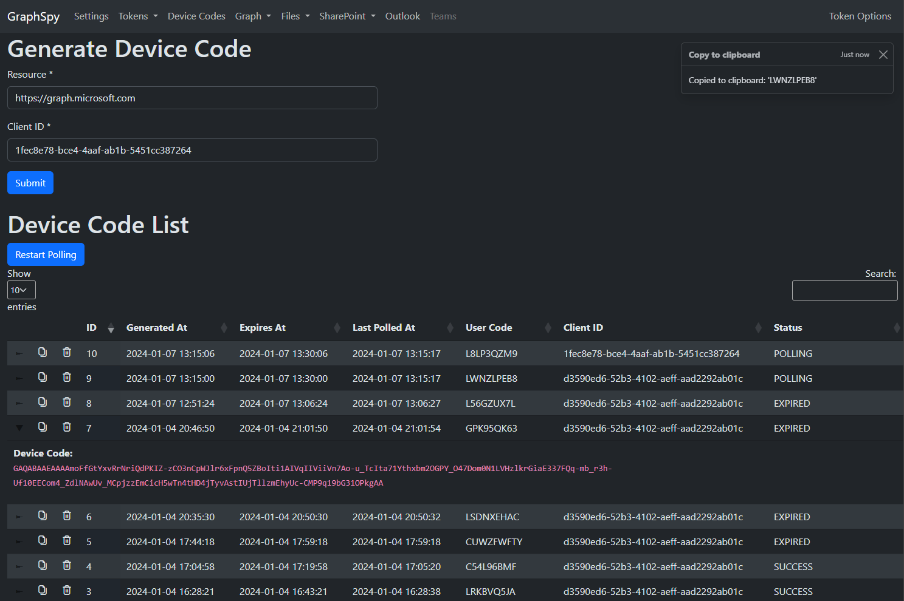
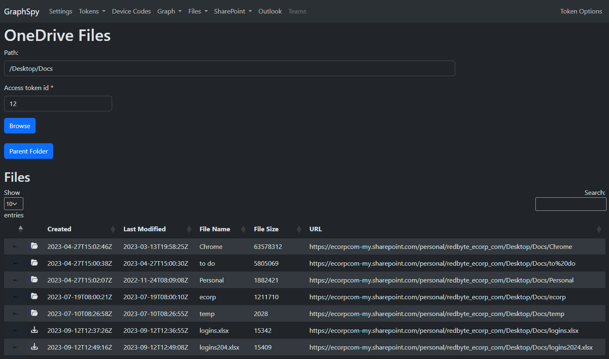
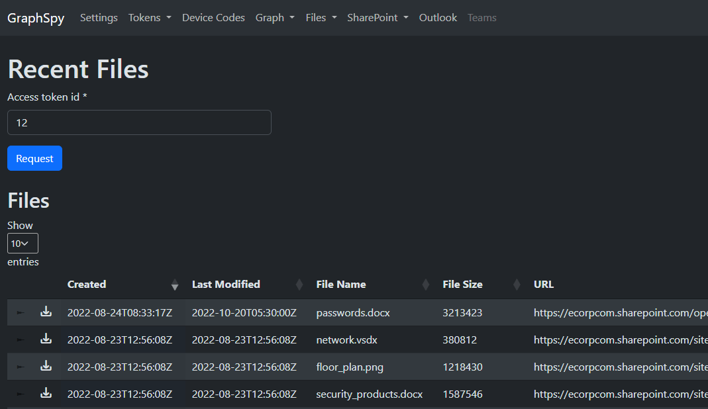
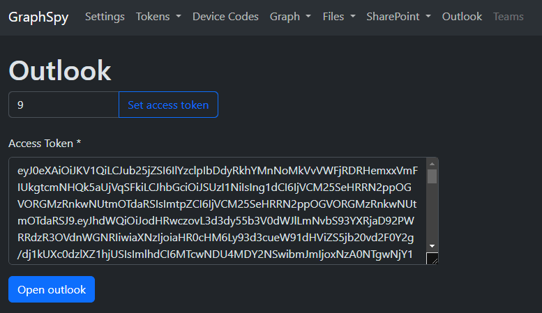
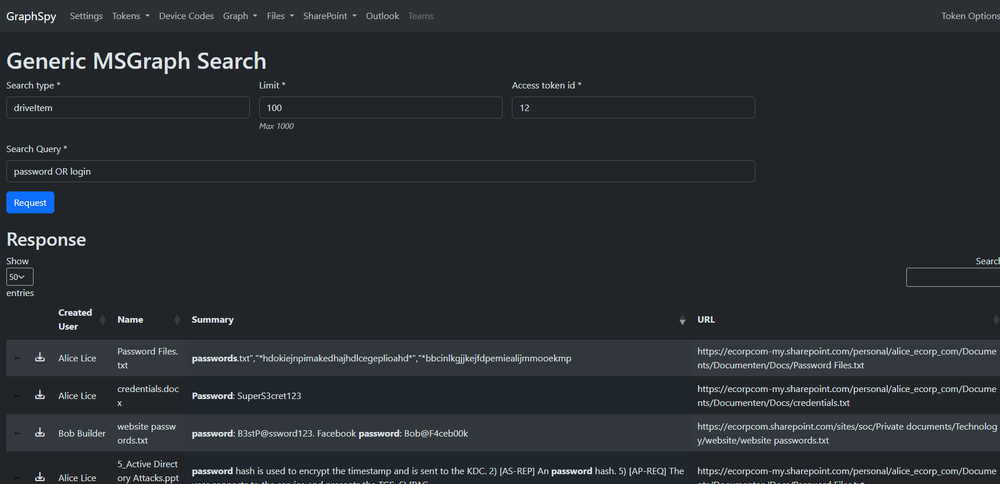
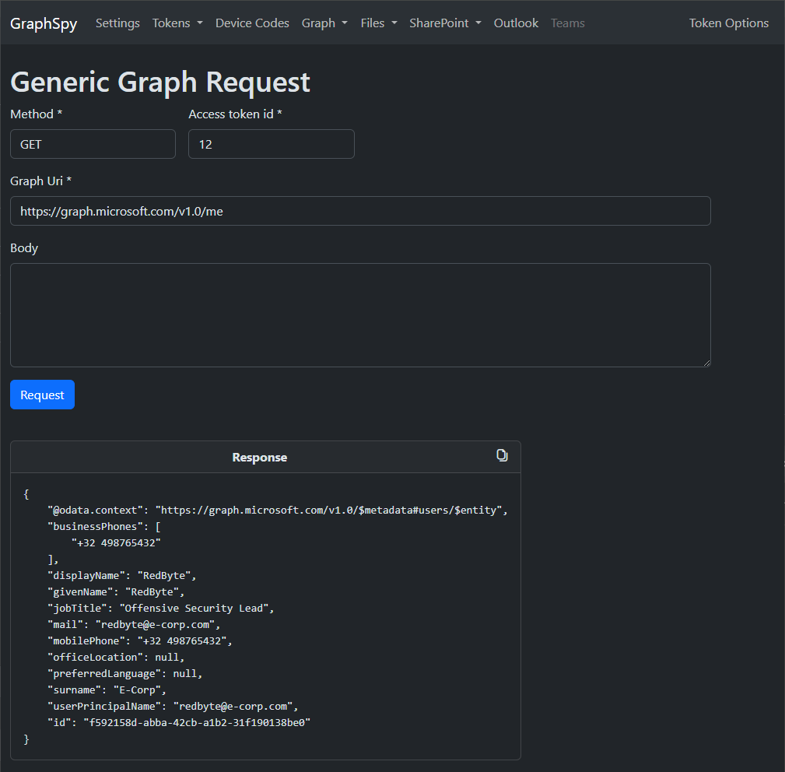
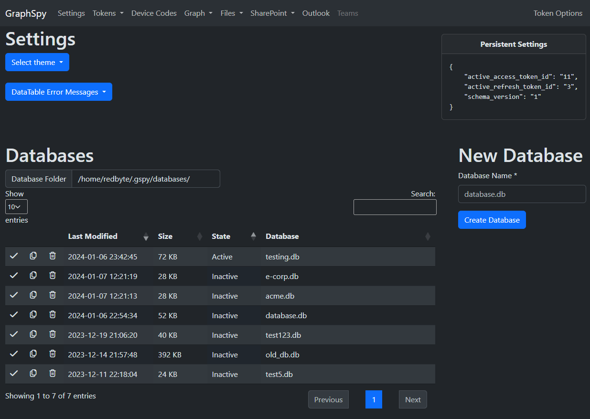

# GraphSpy


```
   ________                             _________
  /       /  by RedByte1337    __      /        /           
 /  _____/___________  ______ |  |__  /   _____/_____ ______
/   \  __\_  __ \__  \ \____ \|  |  \ \_____  \\____ \   |  |
\    \_\  \  | \/  __ \|  |_> |   \  \/        \  |_> \___  |
 \______  /__|  |____  |   __/|___|  /_______  /   ___/ ____|
        \/           \/|__|        \/        \/|__|   \/
```

# Table of Contents

- [GraphSpy](#graphspy)
- [Table of Contents](#table-of-contents)
- [Quick Start](#quick-start)
	- [Installation](#installation)
	- [Execution](#execution)
- [Features](#features)
- [Upcoming Features](#upcoming-features)
- [Credits](#credits)

# Quick Start

## Installation

The following goes over the recommended installation process using pipx to avoid any dependency conflicts.

GraphSpy is built to work on every operating system, although it was mainly tested on Linux and Windows. 

For other installation options and detailed instructions, check the [Installation page](https://github.com/RedByte1337/GraphSpy/wiki/Installation) on the wiki.

```bash
# Install pipx (skip this if you already have it)
apt install pipx
pipx ensurepath

# Install the latest version of GraphSpy from pypi
pipx install graphspy
```

## Execution

After installation, the application can be launched using the `graphspy` command from any location on the system.

Running GraphSpy without any command line arguments will launch GraphSpy and make it available at `http://127.0.0.1:5000` by default.

```bash
graphspy
```

Now simply open `http://127.0.0.1:5000` in your favorite browser to get started!

Use the `-i` and `-p` arguments to modify the interface and port to listen on.

```bash
# Run GraphSpy on http://192.168.0.10
graphspy -i 192.168.0.10 -p 80
# Run GraphSpy on port 8080 on all interfaces
graphspy -i 0.0.0.0 -p 8080
```

For detailed instructions and other command line arguments, please refer to the [Execution page](https://github.com/RedByte1337/GraphSpy/wiki/Execution) on the wiki.

# Features

## Access and Refresh Tokens

Store your access and refresh tokens for multiple users and scopes in one location. 





Easily switch between them or request new access tokens from any page.



## Device Codes

Easily create and poll multiple device codes at once. If a user used the device code to authenticate, GraphSpy will automatically store the access and refresh token in its database.



## Files and SharePoint

Browse through files and folders in the user's OneDrive or any accessible SharePoint site through an intuitive file explorer interface.

Of course, files can also be directly downloaded.



Additionally, list the user's recently accessed files or files shared with the user.



## Outlook

Open the user's Outlook with a single click using just an Outlook access token (FOCI)!




## Graph Searching

Search for keywords through all Microsoft 365 applications using the Microsoft 365 API.

For instance, use this to search for any files or emails containing keywords such as "password", "secret", ...



## Generic Graph Requests

Perform any other MS Graph requests and display the raw response.



## Multiple Databases

GraphSpy supports multiple databases. This is useful when working on multiple assessments at once to keep your tokens and device codes organized.



## Dark Mode

Use the dark mode by default, or switch to light mode.

# Upcoming Features

* Upload, Delete and Rename Files
* More authentication options
	* Password, ESTSAuth Cookie, PRT, ...
* Advanced token customization options and optional v2 API support (CAE)
* Automatic Access Token Refreshing
* Set a custom user agent
* Microsoft Teams
	* Sadly, most MSGrapgh scopes required for Microsoft Teams can not be obtained through a FOCI client id, limiting the usecases where it could be accessed.
	* So the best option would be to use the Skype API, which is a FOCI resource, although this API is not documented by Microsoft or intended for public use
* Azure AD
	* List Users, Groups, Applications, Devices, Conditional Access Policies, ...
* Cleaner exception handling
	* While this should not have any direct impact on the user, edge cases might currently throw exceptions to the GraphSpy output instead of handling them in a cleaner way.

# Credits

The main motivation for creating GraphSpy was the lack of an easy to use way to perform post-compromise activities targetting Office365 applications (such as Outlook, Microsoft Teams, OneDrive, SharePoint, ...) with just an access token.

While several command-line tools existed which provided some basic functionality, none of them came close to the intuitive interactive experience which the original applications provide (such as the file explorer-like interface of OneDrive and SharePoint).

However, a lot of previous research was done by countless other persons (specifically regarding Device Code Phishing, which lead to the initial requirement for such a tool in the first place).

* Acknowledgements
	* [TokenTactics](https://github.com/rvrsh3ll/TokenTactics) and [TokenTacticsV2](https://github.com/f-bader/TokenTacticsV2)
	* [AADInternals](https://github.com/Gerenios/AADInternals)
	* [Introducing a new phishing technique for compromising Office 365 accounts](https://aadinternals.com/post/phishing/)
	* [The Art of the Device Code Phish](https://0xboku.com/2021/07/12/ArtOfDeviceCodePhish.html)
	* [GraphRunner](https://github.com/dafthack/GraphRunner) is a PowerShell tool with a lot of similar features, which was released while GraphSpy was already in development. Regardless, both tools still have their distinguishing factors.
* Assets
	* UIcons by [Flaticon](https://www.flaticon.com/uicons)